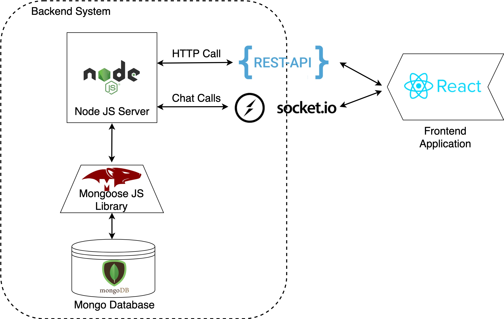
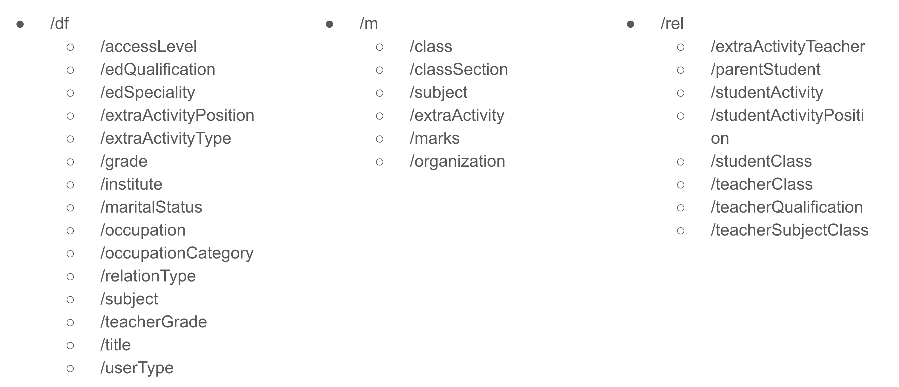

# school-management-backend

## Backend System Overview

## REST API
[API Docs](docs/api.yaml)

* Backend default port: 4000
* Base address: http://<HOST_NAME>:4000/
* Route Categories:
    * /login - Login related routes
    * /class - Class Management related routes
    * /homework - Homework related routes
    * /df - definition related routes
    * /m - master routes
    * /rel - relationship related routes

### Login Routes

### Admin Routes

### Parent Routes

### Teacher Routes
.jpg)

### Class Routes

### Homework Routes

### All Other Routes

The following is the list of routes following the above architecture

### Chat Module Architecture
.jpg)

## Project Report

>>>>>  gd2md-html alert:  ERRORs: 0; WARNINGs: 1; ALERTS: 30.

<ul style="color: red; font-weight: bold"><li>See top comment block for details on ERRORs and WARNINGs. <li>In the converted Markdown or HTML, search for inline alerts that start with >>>>>  gd2md-html alert:  for specific instances that need correction.</ul>

Links to alert messages:
<a href="#gdcalert1">alert1</a>
<a href="#gdcalert2">alert2</a>
<a href="#gdcalert3">alert3</a>
<a href="#gdcalert4">alert4</a>
<a href="#gdcalert5">alert5</a>
<a href="#gdcalert6">alert6</a>
<a href="#gdcalert7">alert7</a>
<a href="#gdcalert8">alert8</a>
<a href="#gdcalert9">alert9</a>
<a href="#gdcalert10">alert10</a>
<a href="#gdcalert11">alert11</a>
<a href="#gdcalert12">alert12</a>
<a href="#gdcalert13">alert13</a>
<a href="#gdcalert14">alert14</a>
<a href="#gdcalert15">alert15</a>
<a href="#gdcalert16">alert16</a>
<a href="#gdcalert17">alert17</a>
<a href="#gdcalert18">alert18</a>
<a href="#gdcalert19">alert19</a>
<a href="#gdcalert20">alert20</a>
<a href="#gdcalert21">alert21</a>
<a href="#gdcalert22">alert22</a>
<a href="#gdcalert23">alert23</a>
<a href="#gdcalert24">alert24</a>
<a href="#gdcalert25">alert25</a>
<a href="#gdcalert26">alert26</a>
<a href="#gdcalert27">alert27</a>
<a href="#gdcalert28">alert28</a>
<a href="#gdcalert29">alert29</a>
<a href="#gdcalert30">alert30</a>

>>>>> PLEASE check and correct alert issues and delete this message and the inline alerts.

1. **_Introduction_**
    1. **_Project Background _**

. The education sector is a fast-growing industry in Sri Lanka. Due to the rapid development of the private school system, there is huge competition among schools and parents (Department of Census & Statistics, 2019).

>>>>>  gd2md-html alert: inline image link here (to images/image1.png). Store image on your image server and adjust path/filename/extension if necessary.  (<a href="#">Back to top</a>)(<a href="#gdcalert2">Next alert</a>) >>>>> 

Schools are expected to provide many sporting activities and subjects to their students. Due to the higher workload, schools and teachers forget to deliver the required information within a limited period. There is a direct impact on children's education due to this delay. Most of the children like to play or do anything other than homework. If parents or teachers didn’t give any homework, many children would not do any work related to education.

>>>>>  gd2md-html alert: inline image link here (to images/image2.jpg). Store image on your image server and adjust path/filename/extension if necessary.  (<a href="#">Back to top</a>)(<a href="#gdcalert3">Next alert</a>) >>>>> 

Less work will lead them to lower performances. If parents identify the reasons, they can find solutions. Parent-teacher meetings, home-work, past papers and term tests can be used to identify and correct the weakness of students. Fast and efficient communication and resource sharing between teachers and parents can be used to identify and correct the weaknesses of the children. School attendance is also very important to generate higher performances (attendanceworks.org, 2018).

The team was named as HexaTech as a motivation factor. All team members are possed with keen to learn and overcome challenges.

Members of the team are:

<table>
  <tr>
   <td>
<ol>

<li>Thissa Gunarathne
</li>
</ol>
   </td>
   <td rowspan="6" >as
   </td>
   <td>

Project Manager

   </td>
  </tr>
  <tr>
   <td>
<ol>

<li>Amila Dissanayaka
</li>
</ol>
   </td>
   <td>

Server Administrator

   </td>
  </tr>
  <tr>
   <td>
<ol>

<li>Preshan Visad Silva
</li>
</ol>
   </td>
   <td>

Business Analyst

   </td>
  </tr>
  <tr>
   <td>
<ol>

<li>Niruhan Viswarupan
</li>
</ol>
   </td>
   <td>

System Developer

   </td>
  </tr>
  <tr>
   <td>
<ol>

<li>Mohan Prakashini
</li>
</ol>
   </td>
   <td>

QA Executive

   </td>
  </tr>
  <tr>
   <td>
<ol>

<li>Lankitha Gallage
</li>
</ol>
   </td>
   <td>

System Developer

   </td>
  </tr>
</table>

    2. **_Aims and objectives _**

>>>>>  gd2md-html alert: inline image link here (to images/image3.png). Store image on your image server and adjust path/filename/extension if necessary.  (<a href="#">Back to top</a>)(<a href="#gdcalert4">Next alert</a>) >>>>> 

As a team, we expect to reduce the communication gap between teachers and parents. Shilpa (Ys,am) is a **_Progressive Web Application_** developed using **_MERN Stack_** which is to create a user-friendly personalized environment for schools, to maintain their communication between teachers, parents, and students. 

>>>>>  gd2md-html alert: inline image link here (to images/image4.png). Store image on your image server and adjust path/filename/extension if necessary.  (<a href="#">Back to top</a>)(<a href="#gdcalert5">Next alert</a>) >>>>> 

We aim to develop the efficiency of teachers and school management for better results. Development objectives can be categorized into five areas;

        1. **_App messaging:_**

<table>
  <tr>
   <td rowspan="5" >
<strong><em>Message to</em></strong>
   </td>
   <td>
<ol>

<li><em>All the members</em>
</li>
</ol>
   </td>
  </tr>
  <tr>
   <td>
<ol>

<li><em>An entire grade</em>
</li>
</ol>
   </td>
  </tr>
  <tr>
   <td>
<ol>

<li><em>An entire class</em>
</li>
</ol>
   </td>
  </tr>
  <tr>
   <td>
<ol>

<li><em>A particular parent</em>
</li>
</ol>
   </td>
  </tr>
  <tr>
   <td>
<ol>

<li><em>A teacher from a parent</em>
</li>
</ol>
   </td>
  </tr>
</table>

        2. **_Notifications:_**

<table>
  <tr>
   <td rowspan="5" >
<strong><em>Send Notifications to</em></strong>
   </td>
   <td>
<ol>

<li><em>Student unauthorized absence</em>
</li>
</ol>
   </td>
  </tr>
  <tr>
   <td>
<ol>

<li><em>Fees reminders</em>
</li>
</ol>
   </td>
  </tr>
  <tr>
   <td>
<ol>

<li><em>Parent-teacher meetings</em>
</li>
</ol>
   </td>
  </tr>
  <tr>
   <td>
<ol>

<li><em>Homework</em>
</li>
</ol>
   </td>
  </tr>
  <tr>
   <td>
<ol>

<li><em>Annual student profile update by parents</em>
</li>
</ol>
   </td>
  </tr>
</table>

        3. **_Time tables:_**

<table>
  <tr>
   <td rowspan="3" >
<strong><em>Record</em></strong>
   </td>
   <td>
<ol>

<li><em>Class time table</em>
</li>
</ol>
   </td>
  </tr>
  <tr>
   <td>
<ol>

<li><em>Exam time table</em>
</li>
</ol>
   </td>
  </tr>
  <tr>
   <td>
<ol>

<li><em>Extra activities</em>
</li>
</ol>
   </td>
  </tr>
</table>

        4. **_Downloads:_**

<table>
  <tr>
   <td rowspan="3" >
<strong><em>Links to download</em></strong>
   </td>
   <td>
<ol>

<li><em>Exam report card</em>
</li>
</ol>
   </td>
  </tr>
  <tr>
   <td>
<ol>

<li><em>Exam past papers</em>
</li>
</ol>
   </td>
  </tr>
  <tr>
   <td>
<ol>

<li><em>Academic reports</em>
</li>
</ol>
   </td>
  </tr>
</table>

        5. **_File update:_**

<table>
  <tr>
   <td rowspan="5" >
<strong><em>Master  & Transaction</em></strong>
   </td>
   <td>
<ol>

<li><em>Student profile</em>
</li>
</ol>
   </td>
  </tr>
  <tr>
   <td>
<ol>

<li><em>Teachers profile</em>
</li>
</ol>
   </td>
  </tr>
  <tr>
   <td>
<ol>

<li><em>School calendar</em>
</li>
</ol>
   </td>
  </tr>
  <tr>
   <td>
<ol>

<li><em>Contact information</em>
</li>
</ol>
   </td>
  </tr>
  <tr>
   <td>
<ol>

<li><em>Attendance</em>
</li>
</ol>
   </td>
  </tr>
</table>

    3. **_Project Planning_**

<table>
  <tr>
   <td>

>>>>>  gd2md-html alert: inline image link here (to images/image5.png). Store image on your image server and adjust path/filename/extension if necessary.  (<a href="#">Back to top</a>)(<a href="#gdcalert6">Next alert</a>) >>>>> 

   </td>
   <td><em>Here shows the Gantt chart used in the life cycle of software development of the project.</em>
<ul>

<li>There are five milestones to check the progress with the time. Using milestones project deviation can be identified.
<ul>

<li>Parallel activities are visible in the same colours. Then identification of such tasks is easier than other tasks.
</li>
</ul>
</li>
</ul>
   </td>
  </tr>
</table>

    4. **_Task Allocation_**

Task allocation is done according to the selected role of the members. There are three members allocated for programming and development related tasks. Other three members are assigned for quality assurance, business analysis and project management. Task allocation sheet is an effective way to identify members assigned for each task.

<table>
  <tr>
   <td colspan="4" ><strong><em>Project Name</em></strong>

<strong><em>Shilpa(Parents teacher communication application)</em></strong>
   </td>
   <td colspan="3" ><strong><em>Project Start Date</em></strong>

<strong><em>15/01/2020</em></strong>
   </td>
  </tr>
  <tr>
   <td><em>Brainstorming</em>
   </td>
   <td>15/12/2019
   </td>
   <td>High
   </td>
   <td>15/12/2019
   </td>
   <td>Done
   </td>
   <td>Every team member
   </td>
   <td>Discussion about the project topics
   </td>
  </tr>
  <tr>
   <td><em>Requirement gathering</em>
   </td>
   <td>30/1/2020
   </td>
   <td>Normal
   </td>
   <td>28/01/2020
   </td>
   <td>Done
   </td>
   <td>Preshan
   </td>
   <td>Completed successfully
   </td>
  </tr>
  <tr>
   <td><em>Business feasibility analysis</em>
   </td>
   <td>4/2/2020
   </td>
   <td>Normal
   </td>
   <td>3/2/2020
   </td>
   <td>Done
   </td>
   <td>Preshan/Amila/Thissa
   </td>
   <td>Completed successfully
   </td>
  </tr>
  <tr>
   <td><em>Technical feasibility analysis</em>
   </td>
   <td>10/2/2020
   </td>
   <td>Normal
   </td>
   <td>10/2/2020
   </td>
   <td>Done
   </td>
   <td>Lankitha/Niruhan/Amila
   </td>
   <td>Completed successfully
   </td>
  </tr>
  <tr>
   <td><em>Software design phase 1</em>
   </td>
   <td>15/02/2020
   </td>
   <td>High
   </td>
   <td>15/02/2020
   </td>
   <td>Done
   </td>
   <td>Lankitha/Preshan/Amila
   </td>
   <td>Completed successfully
   </td>
  </tr>
  <tr>
   <td><em>Software design phase 2</em>
   </td>
   <td>18/02/2020
   </td>
   <td>High
   </td>
   <td>18/02/2020
   </td>
   <td>Done
   </td>
   <td>Preshan/Niruhan/Lankitha
   </td>
   <td>Completed successfully
   </td>
  </tr>
  <tr>
   <td><em>User interface design</em>
   </td>
   <td>14/02/2020
   </td>
   <td>Normal
   </td>
   <td>27/03/2020
   </td>
   <td>Pending
   </td>
   <td>Lankitha
   </td>
   <td>Pending due to the workload of the programmer
   </td>
  </tr>
  <tr>
   <td><em>Quality Assurance Of the Design</em>
   </td>
   <td>20/02/2020
   </td>
   <td>Normal
   </td>
   <td>27/03/2020
   </td>
   <td>Pending
   </td>
   <td>Prakashini
   </td>
   <td>Partially completed
   </td>
  </tr>
  <tr>
   <td><em>Back-end Programming</em>
   </td>
   <td>8/3/2020
   </td>
   <td>High
   </td>
   <td>10/3/2020
   </td>
   <td>Done
   </td>
   <td>Niruhan
   </td>
   <td>Most of the development process done
   </td>
  </tr>
  <tr>
   <td><em>Front-end programming</em>
   </td>
   <td>15/03/2020
   </td>
   <td>High
   </td>
   <td>27/03/2020
   </td>
   <td>Pending
   </td>
   <td>Lankitha
   </td>
   <td>Pending due to the workload of the programmer
   </td>
  </tr>
  <tr>
   <td><em>Integration of the Modules</em>
   </td>
   <td>17/03/2020
   </td>
   <td>High
   </td>
   <td>27/03/2020
   </td>
   <td>Pending
   </td>
   <td>Lankitha/Amila/Niruhan
   </td>
   <td>Pending due to defendant work
   </td>
  </tr>
  <tr>
   <td><em>Testing</em>
   </td>
   <td>18/03/2020
   </td>
   <td>Normal
   </td>
   <td>27/03/2020
   </td>
   <td>Pending
   </td>
   <td>Prakashini/Preshan/Thissa
   </td>
   <td>Pending due to defendant work
   </td>
  </tr>
  <tr>
   <td><em>Quality Assurance Of the software</em>
   </td>
   <td>20/03/2020
   </td>
   <td>Normal
   </td>
   <td>27/03/2020
   </td>
   <td>Pending
   </td>
   <td>Prakashini
   </td>
   <td>Pending due to defendant work
   </td>
  </tr>
  <tr>
   <td><em>Finalize the development process </em>
   </td>
   <td>20/03/2020
   </td>
   <td>Normal
   </td>
   <td>27/03/2020
   </td>
   <td>Pending
   </td>
   <td>Lankitha/Niruhan/Preshan
   </td>
   <td>Pending due to defendant work
   </td>
  </tr>
</table>

    5. **_Risk management_**

Risk management is an important part of the successful completion of the project. Software risk management requires a greater depth of knowledge than other risk management processes.

**_Identified Risks _**

<table>
  <tr>
   <td><strong><em>ID</em></strong>
   </td>
   <td><strong><em>Identified Risk</em></strong>
   </td>
   <td><strong><em>Risk management method</em></strong>
   </td>
  </tr>
  <tr>
   <td><strong><em>R1</em></strong>
   </td>
   <td><em>Not being able to complete the project on time</em>
   </td>
   <td>Assign half of the team members for development related tasks. Frequently ask programmers to present their work.
   </td>
  </tr>
  <tr>
   <td><strong><em>R2</em></strong>
   </td>
   <td><em>Less user satisfaction</em>
   </td>
   <td>Instructions were given to the developers and business analysis to tally the gathered requirements and development output. 
   </td>
  </tr>
  <tr>
   <td><strong><em>R3</em></strong>
   </td>
   <td><em>Cost overrun</em>
   </td>
   <td>Encourage members to develop most of the modules within the team. 
   </td>
  </tr>
  <tr>
   <td><strong><em>R4</em></strong>
   </td>
   <td><em>Complete failure of the project.</em>
   </td>
   <td>Due to coronavirus infections, there is a possibility that the project fails. Advice has given to the members to maintain their health.
   </td>
  </tr>
  <tr>
   <td><strong><em>R5</em></strong>
   </td>
   <td><em>Software quality problems</em>
   </td>
   <td>Rigorous quality assurance testing and validation
   </td>
  </tr>
  <tr>
   <td><strong><em>R6</em></strong>
   </td>
   <td><em>knowledge gaps of the members</em>
   </td>
   <td>Self-learning  the identified gaps online, and knowledge sharing among group members
   </td>
  </tr>
  <tr>
   <td><strong><em>R7</em></strong>
   </td>
   <td><em>Less Commitment of the team members.</em>
   </td>
   <td>Always motivate team member to finish the work as soon as possible
   </td>
  </tr>
</table>

                                      

1. **_System Analysis_**

System analysis is used to identify requirements and convert them into a software reality. First required information should be collected. By analysing gathered requirements, the framework of the software can be designed.

    6. **_Fact gathering techniques_**

_We used the following techniques to gather the required information._

1. **_Interviews_** - Top-down approach used frequently
2. **_Observation_** - school work process observed 
3. **_Document Analysis_** - analysis student reports, school letters and documents   published on the notice board
    7. **_Analysis of gathered facts_**

According to the gathered facts, most of the schools expect unique applications rather than a common application. They need to overcome the weakness of the Whatsapp app. Their budget is also limited. Schools expect to reduce the workload of the teachers up to some extent. They mainly expect attendance, absence tracking, homework distribution, attendance to extracurricular activities, payment reminders and individual directed communication using the mobile application. Better security of the application and over-the-phone production support also among the expectations of the school management.

    8. **_Software Requirement Specification_**

**_Introduction: _**The purpose of this document is to improve communication systems in school.									

**_Document convention_: **Database, distributed database and the entity relationships

    9. **_Feasibility Study_**
        6. **_Economic feasibility_**
1. SHILPA reduced a lot of manual work in school.
2. Using SHILPA app school's work efficiency will be improved.
3. Student’s sensitive information (eg. medical updates) can be updated safely and no unauthorized access.

**_Therefore Shilps app is economically feasible._**

 

        7. **_Technical feasibility_**
1. MongoDB is used as a database which is easy to install and setup and easy to scale. 
2. The app is developed under the ReactJS environment where it provides real and significant mobile applications and it supports both Android and iOS mobile devices. It will save developers time because developers do not need to develop two applications for Android and iOS.

**_Therefore Shilpa app can be developed in a reasonable time._**

        8. **_Operational feasibility _**

The Shilpa app develops to enhance communication and relationship between schools and families. Since the app can run on both Android and iOS mobile devices, anyone can log in to the app at any time anywhere. School computer laptops or tablets can be used for backend purposes. Since the server is hosted on the cloud, no need to keep the server administrator to look after the server and take backups. 

**_Therefore  Shilpa app is operationally easy to handle._**

    10. **_Intended audience & suggestions_**

The system is restricted within the school premises with admin, students, parents and teachers.  This was implemented under the requirements gathered from;

<table>
  <tr>
   <td><strong><em>Interview with</em></strong>
   </td>
   <td><strong><em>Position</em></strong>
   </td>
   <td><strong><em>School</em></strong>
   </td>
  </tr>
  <tr>
   <td>Rev.Fr. Indunil Sampath
   </td>
   <td>Rector (Primary Principle)
   </td>
   <td>St. Sebastian’s College, Mortuwa.
   </td>
  </tr>
  <tr>
   <td>Mrs Aruni Fernando
   </td>
   <td>Class teacher
   </td>
   <td>St. Sebastian’s College, Mortuwa.
   </td>
  </tr>
  <tr>
   <td>Mrs Shalika Perera
   </td>
   <td>Parent
   </td>
   <td>St. Sebastian’s College, Mortuwa.
   </td>
  </tr>
  <tr>
   <td>Mas Nimira Cooray
   </td>
   <td>Student
   </td>
   <td>St. Sebastian’s College, Mortuwa.
   </td>
  </tr>
  <tr>
   <td>Mrs Sharmila Fernando
   </td>
   <td>Sectional head
   </td>
   <td>Holy Family Convent, Bambalapitiya.
   </td>
  </tr>
  <tr>
   <td>Mrs Rozan
   </td>
   <td>English teacher
   </td>
   <td>Holy Family Convent, Bambalapitiya.
   </td>
  </tr>
</table>

    11. **_Project Scope_**
1. Access to students, parents, teachers, and admins to use the new application
2. Direct messaging between teachers and parents
3. Storing student details in the database
4. Attendance tracking
5. Fee status tracking and reminders
6. Parent-teacher meeting scheduling
7. Homework distribution
    12. **_Out of Scope_**
1. Online fee payment through gateway
2. Timetable for subjects, extracurricular activities
3. Advanced level stream recommendation
4. School transport GPS tracking
5. School calendar view

    13. **_Other Equivalent Systems_**

We refer to a few other systems to identify the process. We aim to identify the process to build our system with the higher compatible ability to the market. here are a few systems with their functions.

        9. **_ParentSquare _**

>>>>>  gd2md-html alert: inline image link here (to images/image6.png). Store image on your image server and adjust path/filename/extension if necessary.  (<a href="#">Back to top</a>)(<a href="#gdcalert7">Next alert</a>) >>>>> 

**_Features:_**

<table>
  <tr>
   <td>
<ol>

<li>Sending individual messages
</li>
</ol>
   </td>
  </tr>
  <tr>
   <td>
<ol>

<li>Sending group messages
</li>
</ol>
   </td>
  </tr>
  <tr>
   <td>
<ol>

<li>Newsletters
</li>
</ol>
   </td>
  </tr>
  <tr>
   <td>
<ol>

<li>Sending emergency alerts/notification
</li>
</ol>
   </td>
  </tr>
  <tr>
   <td>
<ol>

<li>Students attendance management
</li>
</ol>
   </td>
  </tr>
  <tr>
   <td>
<ol>

<li>School directory
</li>
</ol>
   </td>
  </tr>
  <tr>
   <td>
<ol>

<li>Payments update
</li>
</ol>
   </td>
  </tr>
  <tr>
   <td>
<ol>

<li>School calendar
</li>
</ol>
   </td>
  </tr>
</table>

        10. **_  TASS.web_**

>>>>>  gd2md-html alert: inline image link here (to images/image7.png). Store image on your image server and adjust path/filename/extension if necessary.  (<a href="#">Back to top</a>)(<a href="#gdcalert8">Next alert</a>) >>>>> 

**_Features:_**

<table>
  <tr>
   <td>
<ol>

<li>Student profile / Attendance / Assignment
</li>
</ol>
   </td>
  </tr>
  <tr>
   <td>
<ol>

<li>Update medical information of the student
</li>
</ol>
   </td>
  </tr>
  <tr>
   <td>
<ol>

<li>Behavioural management
</li>
</ol>
   </td>
  </tr>
  <tr>
   <td>
<ol>

<li>The Internet payment gateway for pay fees
</li>
</ol>
   </td>
  </tr>
  <tr>
   <td>
<ol>

<li>Test time tables
</li>
</ol>
   </td>
  </tr>
  <tr>
   <td>
<ol>

<li>Test results
</li>
</ol>
   </td>
  </tr>
  <tr>
   <td>
<ol>

<li>Assessment results
</li>
</ol>
   </td>
  </tr>
  <tr>
   <td>
<ol>

<li>View teachers comments 
</li>
</ol>
   </td>
  </tr>
</table>

2. **_Product description_**
    14. **_Product Perspective_**

There are three major users of the system;

<table>
  <tr>
   <td><strong><em>Student</em></strong>

Basic Student Information

Class Details

Attendance

Marks

Extracurricular Activities
   </td>
   <td><strong><em>Parent</em></strong>

Basic Parent Information

Occupation Details
   </td>
   <td><strong><em>Teacher</em></strong>

Basic teacher Information

Education qualifications

Teaching subjects

Extracurricular
   </td>
  </tr>
</table>

>>>>>  gd2md-html alert: inline image link here (to images/image8.jpg). Store image on your image server and adjust path/filename/extension if necessary.  (<a href="#">Back to top</a>)(<a href="#gdcalert9">Next alert</a>) >>>>> 

Apart from the users mentioned above, there are administrative users. Who have all the rights to maintain the system.

    15. **_User Class and Characteristics_**

>>>>>  gd2md-html alert: inline image link here (to images/image9.png). Store image on your image server and adjust path/filename/extension if necessary.  (<a href="#">Back to top</a>)(<a href="#gdcalert10">Next alert</a>) >>>>> 

        11. **_Functions & Features are shown below_**

**_Functions:_**

1. Hostel administration (future development)
2. Learning administration
3. Education dashboard
4. Class, marks and registration update
5. Disciplinary management etc.(future development)

**_Features_**:

1. Centralized app for schools
2. Maintain system users
3. Sending messages, popup notifications to parents
4. Finalizing the exam marks, average, ranks
5. Informing the parent's meetings, calendar reminders
6. Downloads

>>>>>  gd2md-html alert: inline image link here (to images/image10.png). Store image on your image server and adjust path/filename/extension if necessary.  (<a href="#">Back to top</a>)(<a href="#gdcalert11">Next alert</a>) >>>>> 

    16. **_Tools & Environment _**

<table>
  <tr>
   <td>

>>>>>  gd2md-html alert: inline image link here (to images/image11.png). Store image on your image server and adjust path/filename/extension if necessary.  (<a href="#">Back to top</a>)(<a href="#gdcalert12">Next alert</a>) >>>>> 

   </td>
   <td>

>>>>>  gd2md-html alert: inline image link here (to images/image12.png). Store image on your image server and adjust path/filename/extension if necessary.  (<a href="#">Back to top</a>)(<a href="#gdcalert13">Next alert</a>) >>>>> 

   </td>
   <td>

>>>>>  gd2md-html alert: inline image link here (to images/image13.jpg). Store image on your image server and adjust path/filename/extension if necessary.  (<a href="#">Back to top</a>)(<a href="#gdcalert14">Next alert</a>) >>>>> 

   </td>
   <td>

>>>>>  gd2md-html alert: inline image link here (to images/image14.jpg). Store image on your image server and adjust path/filename/extension if necessary.  (<a href="#">Back to top</a>)(<a href="#gdcalert15">Next alert</a>) >>>>> 

   </td>
  </tr>
  <tr>
   <td>

>>>>>  gd2md-html alert: inline image link here (to images/image15.png). Store image on your image server and adjust path/filename/extension if necessary.  (<a href="#">Back to top</a>)(<a href="#gdcalert16">Next alert</a>) >>>>> 

   </td>
   <td>

>>>>>  gd2md-html alert: inline image link here (to images/image16.png). Store image on your image server and adjust path/filename/extension if necessary.  (<a href="#">Back to top</a>)(<a href="#gdcalert17">Next alert</a>) >>>>> 

   </td>
   <td>

>>>>>  gd2md-html alert: inline image link here (to images/image17.png). Store image on your image server and adjust path/filename/extension if necessary.  (<a href="#">Back to top</a>)(<a href="#gdcalert18">Next alert</a>) >>>>> 

   </td>
   <td>
   </td>
  </tr>
</table>

The operating environment for this school application is used are;

1. Hosting Server – **_CentOS 7.8_**
2. Firewall – **_IPTables_**
3. Frontend Platform – **_ReactJS_**
4. Backend Platform – **_NodeJs_** + **_Express_**
5. Database – **_MongoDB_**
6. Push Notifications - **_Firebase_**
    17. **_Database distribution_**

>>>>>  gd2md-html alert: inline drawings not supported directly from Docs. You may want to copy the inline drawing to a standalone drawing and export by reference. See <a href="https://github.com/evbacher/gd2md-html/wiki/Google-Drawings-by-reference">Google Drawings by reference</a> for details. The img URL below is a placeholder.  (<a href="#">Back to top</a>)(<a href="#gdcalert19">Next alert</a>) >>>>> 

                                                                                                      

    18. **_Client / Server System_**
1. Distributed with client/server side.
2. All data resides on the server-side
3. The application executed on the client-side.
    19. **_ Hardware_**

_The system can be used with the following hardware_

1. Tablet
2. Desktop
3. Mobile phone
    20. **_Software Quality Attributes_**
1. **_Availability_**: including all detailed information(competition venue, time transport facility).
2. **_Correctness_**: passing an accurate information
3. **_Maintainability_**: admin will manage the database and the app
4. **_Usability_**: satisfy the school team and parents.
3. **_System Design_**
    21. **_ 3-Tier Architecture_**

Three-tier architecture is used to compose the layers of logical computing,  as per to our application we used as a specific type of server-side and client-side.  This supported many benefits for the development environment and modularizing the user's interface, data storage of a school. As well, it was very useful to update a specific new feature to an application independently of other parts with flexible improvement in the overall development process. This is used because it can help the application to redevelop and modernize without affecting other functional business data access. It contains a presentation, layer and data tier and well supportive architecture to speed up the development of an application and to check it’s performances and to modularize.

It was used for end application from the database and selected according to school needs, specific parts of the application without affecting other features. These were developed as layers it showed in below image.

>>>>>  gd2md-html alert: inline image link here (to images/image18.png). Store image on your image server and adjust path/filename/extension if necessary.  (<a href="#">Back to top</a>)(<a href="#gdcalert20">Next alert</a>) >>>>> 

    22. **_Agile Methodology_**

This methodology is used to develop school application and it is used to determine  the enhancement needed on the development methods and terms with five those are as  follows;

**_Requirement Analysis_: **The** **stage where the needed requirements are gathered in some schools and describe the problems and motivation for building the school application. 										

**_Planning_: **Targeting the end-users and deciding the time duration and frequent versions.  Hence feedback is received regularly. Debugging the errors, and fixing the problems on time.									

**_Designing_**: An approach using XP and coding style with simple designs to log and view by delivering the domain knowledge to users. Tasks are allocated according to the respective developers and keeping the task in the form of a board of “to do” and “in progress”.  **					**

**_Testing_:** Mapping for the process and testing is created in every iteration and it has been started and an artefact is constructed. After the iteration levels, the whole system is tested and results demonstrated immediately. XP uses TDD techniques to ensure all implemented features are tested.						 

**_Release_: **In this phase, we review the results,  then assess the current performance of the application. Identifying whether the system is completed without any errors and failures, Checked whether it is supported to the end-users when release is planned for retirement.	

**_Maintenance_: **Once the feedback is received from schools at each stage, the results are discussed with the team and the features are further improved and the factors are decided according to their perspective.  

This model is used to get high-quality applications and it is a more adaptable alternative with a unique modification. Due to the above features and advantages, we decided to use an Agile methodology to develop our application.

4. **_System development_**
    23. **_Development of the Prototype_**

Two different prototypes were made. The first was made for the interim presentation. Based on the feedback from the lecturer we decided to develop a new prototype from scratch. In the prototype both the frontend and backend was developed within the same project and 3-tire architecture was not fully used. The frontend was developed using ReactJS and the backend using Node.js + Express. The frontend was basic and not responsive. It behaved more like a static web page rather than a responsive React application. Based on suggested data model changes and feature changes we moved onto the next version which is described in the next section.

    24. **_Used Technologies/Algorithm_**

As discussed earlier, a 3-tire architecture was applied in development. Model and controller resided in the backend and the view was made in the front end. The backend was built in Node.js with Express server. Socket.io was used for developing messaging systems. 

The model was designed as Mongoose schemas which can be stored in MongoDB. The backend and frontend communicate using REST API with HTTP requests. The frontend was developed in ReactJS and use Axios to connect with the backend. The UI was developed with Material-UI & Bootstrap. 

>>>>>  gd2md-html alert: inline image link here (to images/image19.png). Store image on your image server and adjust path/filename/extension if necessary.  (<a href="#">Back to top</a>)(<a href="#gdcalert21">Next alert</a>) >>>>> 

Once a user is logged in a key is sent to the frontend, this will be used for all the transactions. And along with the username password, the system is sending the service key using for the push notifications to the server to map the users for the notifications. This is used with the Firebase for the notifications. 

>>>>>  gd2md-html alert: inline image link here (to images/image20.png). Store image on your image server and adjust path/filename/extension if necessary.  (<a href="#">Back to top</a>)(<a href="#gdcalert22">Next alert</a>) >>>>> 

Sample of a sent token is shown below;

>>>>>  gd2md-html alert: inline image link here (to images/image21.png). Store image on your image server and adjust path/filename/extension if necessary.  (<a href="#">Back to top</a>)(<a href="#gdcalert23">Next alert</a>) >>>>> 

Users of the system are derived as Administrators, Teachers, Parents, Students. Each of them has different credentials of the system. Administrators have all the authentication. 

>>>>>  gd2md-html alert: inline image link here (to images/image22.png). Store image on your image server and adjust path/filename/extension if necessary.  (<a href="#">Back to top</a>)(<a href="#gdcalert24">Next alert</a>) >>>>> 

Administrators can maintain the core details of the organization. The option for the privileges is limited.

>>>>>  gd2md-html alert: inline image link here (to images/image23.png). Store image on your image server and adjust path/filename/extension if necessary.  (<a href="#">Back to top</a>)(<a href="#gdcalert25">Next alert</a>) >>>>> 

	Once a notification needs to be sent to a specific group, an administrator or an authorized teacher and push the notifications to the firebase server. And the users will get them instantly. A sample notification is shown below;

>>>>>  gd2md-html alert: inline image link here (to images/image24.png). Store image on your image server and adjust path/filename/extension if necessary.  (<a href="#">Back to top</a>)(<a href="#gdcalert26">Next alert</a>) >>>>> 

System users can also use the internal messaging service to send and receive messages. When a user logged in and chat using socket.io a port is reserving for s particular message thread. System users can be assigned to theses threads by the administrator.

>>>>>  gd2md-html alert: inline image link here (to images/image25.png). Store image on your image server and adjust path/filename/extension if necessary.  (<a href="#">Back to top</a>)(<a href="#gdcalert27">Next alert</a>) >>>>> 

GitHub was used for version controlling and collaborating among team members.

5. **_System QA Testing _**

 **Report**

Testing is combined as manual testing and automated testing for the front end. According to our school application, I used manual testing for the front end by creating the test cases in excel sheets which allows us to cover all functional & nonfunctional scenarios in our system. Back end was tested using MongoDB, Node.js and Postman while testing the back-end the first time it was successful and again when testing other parts overall back-end testing got stuck I restarted and tried to get results but errors continuously occurred therefore that unable to give the results because of time constraints. For front end presentation I used the excel sheet to update the process of application whether the application passes or fails with actual and expected results, test cases are created along with the development. As per our team development, we followed the agile methodology in which it can repeat the process in the development stage and from time to time new features are implemented. To test the function, I used some process & procedures which the specific function got pass without any failure. While testing front end errors and bugs are identified and reported to our developer then all bugs errors are corrected by developers. Once bugs are fixed again, execute the failing test case to verify whether the specific function is passed.

>>>>>  gd2md-html alert: inline image link here (to images/image26.png). Store image on your image server and adjust path/filename/extension if necessary.  (<a href="#">Back to top</a>)(<a href="#gdcalert28">Next alert</a>) >>>>> 

**QA Testing methods, process, procedures**

As a QA the testing more importantly concerned to give a good quality of product to the specific school, therefore that to cover all functional requirements without any failure in the application I followed some testing process and procedures those are as below,

**1.** 	**QA Testing Methods Analyzed**

>>>>>  gd2md-html alert: inline image link here (to images/image27.png). Store image on your image server and adjust path/filename/extension if necessary.  (<a href="#">Back to top</a>)(<a href="#gdcalert29">Next alert</a>) >>>>> 

**2.** 	**Test Design -** Manual Testing with excel test cases

**3.** 	**Testing Methodology - agile testing strategy**

 The below shows the procedures and process how application tested as per to agile testing strategy

** **

>>>>>  gd2md-html alert: inline image link here (to images/image28.png). Store image on your image server and adjust path/filename/extension if necessary.  (<a href="#">Back to top</a>)(<a href="#gdcalert30">Next alert</a>) >>>>> 

** **

** **

** **

** **

** **

**  **

**4.**     **Retest Error test strategy **

Tracking the error in UI if errors are tracked and identified in application reporting to developer to fix the bugs and give back to retest the specific functions to check get pass.

 

 

>>>>>  gd2md-html alert: inline image link here (to images/image29.png). Store image on your image server and adjust path/filename/extension if necessary.  (<a href="#">Back to top</a>)(<a href="#gdcalert31">Next alert</a>) >>>>> 

